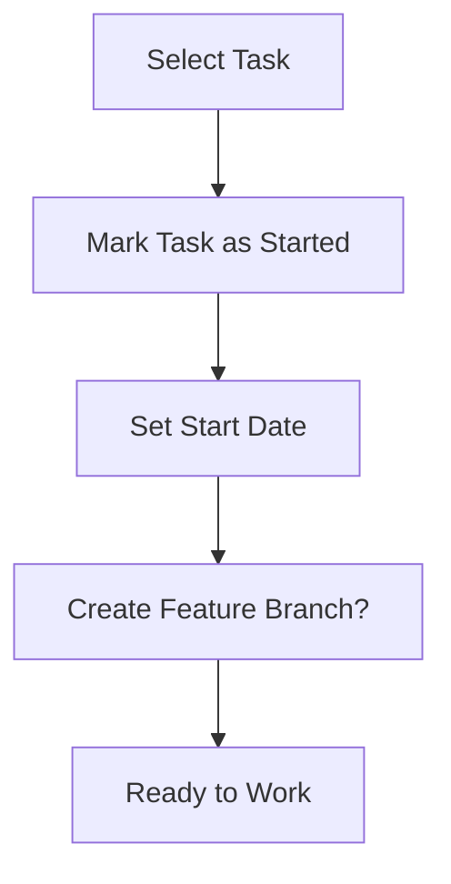
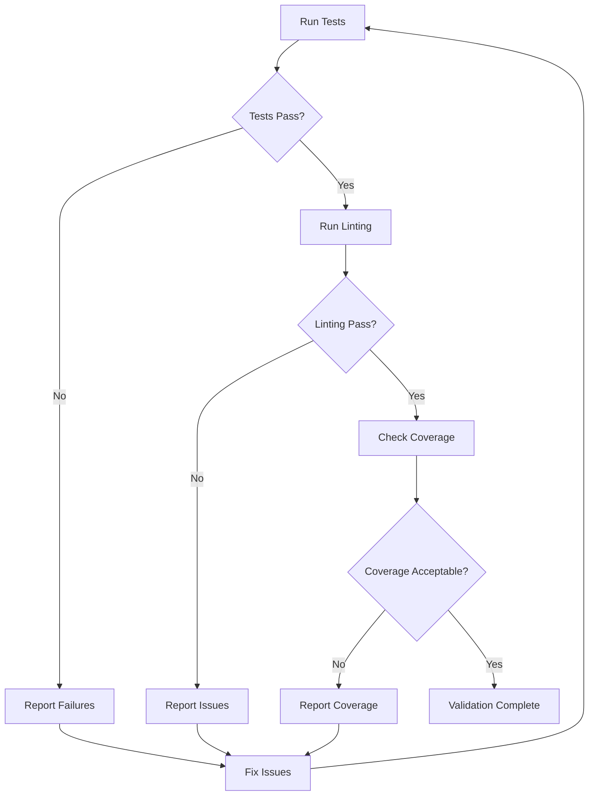
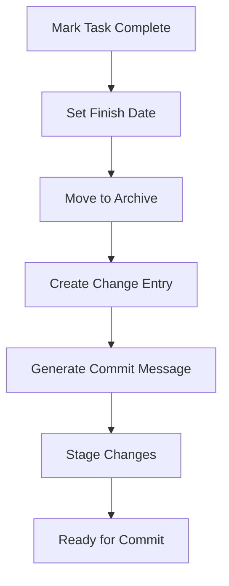

# Task Workflow Automation Plan

This document outlines the plan for automating the "pick a task, do a task, test the change, finalize the change, submit" workflow process.

## Current State Analysis

### Existing Scripts

- [`scripts/dev/create_change_entry.py`](scripts/dev/create_change_entry.py) - Creates changelog entries
- [`scripts/dev/run_tests.py`](scripts/dev/run_tests.py) - Runs tests and manages test-related tasks
- [`scripts/dev/debug_test_parser.py`](scripts/dev/debug_test_parser.py) - Test output parsing utilities

### Current Workflow (Manual Steps)

1. **Pick a task** - Manual selection from TASKS.md
2. **Do the task** - Manual implementation (requires human intelligence)
3. **Test the change** - Partially automated via run_tests.py
4. **Finalize the change** - Manual task completion, change entry creation
5. **Submit the change** - Manual git operations and PR creation

## Proposed Automation Scripts

### 1. New Task Creation Script: `scripts/dev/create_task.py`

**Purpose**: Automate creation of new tasks in TASKS.md

**CLI Interface**:

```bash
python scripts/dev/create_task.py "Fix bug in user authentication" \
  --description "The login form is not validating email addresses properly" \
  --priority High \
  --estimated-time "2 hours" \
  --assignee "Roo" \
  --prerequisites "None"
```

**Features**:

- **Required**: task title, description
- **Auto-generated**: ID (next available), create date (ISO8601)
- **Optional**: priority (default: High), estimated time, assignee, prerequisites
- **Task placement**: Automatically places in appropriate priority section
- **Validation**: Checks for duplicate task titles

**Output**: Prints the task ID and location for reference

### 2. Task Wrap-up Script: `scripts/dev/finish_task.py`

**Purpose**: Automate task completion and archiving workflow

**CLI Interface**:

```bash
# Finish a specific task by ID
python scripts/dev/finish_task.py --task-id 4

# Finish multiple tasks
python scripts/dev/finish_task.py --task-ids 4,5,6

# Interactive mode - shows incomplete tasks and lets you select
python scripts/dev/finish_task.py --interactive
```

**Features**:

- **Task completion**: Marks tasks as complete with finish timestamp
- **Archive management**: Moves completed tasks to Archive section
- **Change entry integration**: Automatically creates change entry using existing script
- **Git integration**: Generates commit message suggestions
- **Validation**: Ensures task exists and is not already completed

**Output**:

- List of completed tasks
- Generated change entry file path
- Suggested commit message with task references

### 3. Workflow Orchestration Script: `scripts/dev/workflow.py`

**Purpose**: Orchestrate the full workflow with automation points

**CLI Interface**:

```bash
# Start working on a task (marks as started)
python scripts/dev/workflow.py start --task-id 4

# Pre-submission checks (testing, linting, validation)
python scripts/dev/workflow.py validate

# Complete workflow (finish task, create change entry, prepare commit)
python scripts/dev/workflow.py complete --task-id 4
```

**Features**:

- **Task startup**: Marks task as started, sets start date
- **Pre-submission validation**: Runs tests, linting, coverage checks
- **Completion workflow**: Combines finish_task.py and validation
- **Git operations**: Staging, commit message generation
- **Error handling**: Stops workflow if validation fails

## Automation Workflow Design

### Phase 1: Task Startup (Automated)



**Script**: `workflow.py start`

- Updates task status in TASKS.md
- Sets start date timestamp
- Optionally creates feature branch

### Phase 2: Task Execution (Manual)

- Human intelligence required
- Implementation, coding, debugging
- Manual process - no automation

### Phase 3: Pre-submission Validation (Automated)



**Script**: `workflow.py validate`

- Uses existing `run_tests.py` functionality
- Adds linting checks (ruff, mypy, etc.)
- Coverage validation
- Documentation checks

### Phase 4: Task Completion (Automated)



**Script**: `workflow.py complete` or `finish_task.py`

- Updates task status and timestamps
- Archives completed task
- Creates change entry file
- Generates commit message with task references

## Implementation Priority

### Phase 1: Core Scripts (Week 1)

1. **`create_task.py`** - New task creation
2. **`finish_task.py`** - Task completion and archiving
3. **Task management utilities** - Shared functions for task parsing/updating

### Phase 2: Validation Enhancement (Week 2)

1. **Enhanced validation** - Extend `run_tests.py` functionality
2. **Linting integration** - Add ruff, mypy, other tools
3. **Coverage enforcement** - Configurable coverage thresholds

### Phase 3: Workflow Orchestration (Week 3)

1. **`workflow.py`** - Main orchestration script
2. **Git integration** - Branch management, commit automation
3. **Error handling and recovery** - Robust error scenarios

### Phase 4: Polish and Integration (Week 4)

1. **Documentation** - Usage guides, examples
2. **Testing** - Test the automation scripts themselves
3. **Refinement** - Based on usage feedback

## File Structure

```
scripts/dev/
├── create_task.py           # New task creation
├── finish_task.py           # Task completion and archiving
├── workflow.py              # Workflow orchestration
├── create_change_entry.py   # Existing - changelog creation
├── run_tests.py             # Existing - test management
├── debug_test_parser.py     # Existing - test utilities
└── task_utils.py            # New - shared task management utilities
```

## Integration Points

### With Existing Scripts

- **`create_change_entry.py`**: Called by `finish_task.py` for change entry creation
- **`run_tests.py`**: Used by `workflow.py validate` for test management
- **TASKS.md**: Central task database updated by all scripts

### With Development Workflow

- **Git hooks**: Optional pre-commit hooks using validation
- **CI/CD**: Scripts can be used in automated testing
- **Documentation**: Auto-update task counts, completion rates

## Configuration

### `scripts/dev/config.yaml` (New)

```yaml
tasks:
  default_priority: "High"
  default_estimated_time: "1 hour"
  auto_archive: true
  
validation:
  coverage_threshold: 80
  linting_tools: ["ruff", "mypy"]
  required_tests: true

workflow:
  auto_branch: false
  commit_template: "feat: {task_title}\n\nAddresses task #{task_id}: {task_description}"
```

## Success Metrics

### Automation Coverage

- **Task Creation**: 95% automated (only title/description manual)
- **Task Completion**: 90% automated (finish times, archiving, change entries)
- **Validation**: 100% automated (tests, linting, coverage)
- **Git Operations**: 80% automated (staging, commit message generation)

### Time Savings

- **Task management**: 5-10 minutes saved per task
- **Change entry creation**: 3-5 minutes saved per change
- **Pre-submission checks**: 2-3 minutes saved per submission
- **Total**: 10-18 minutes saved per task completion cycle

### Error Reduction

- **Forgot to update task status**: Eliminated
- **Incorrect change entry format**: Eliminated
- **Missing validation steps**: Eliminated
- **Inconsistent commit messages**: 90% reduction

## Migration Path

### Week 1: Foundation

- Implement `create_task.py` and `finish_task.py`
- Test with existing TASKS.md structure
- Validate task management utilities

### Week 2: Integration

- Integrate with existing `create_change_entry.py`
- Enhance validation capabilities
- Test full task completion workflow

### Week 3: Orchestration

- Implement `workflow.py`
- Add git integration
- Test complete automation chain

### Week 4: Adoption

- Documentation and training
- Gradual adoption of scripts
- Feedback and refinement

This plan provides a comprehensive automation solution while preserving the manual "do the work" step that requires human intelligence.
